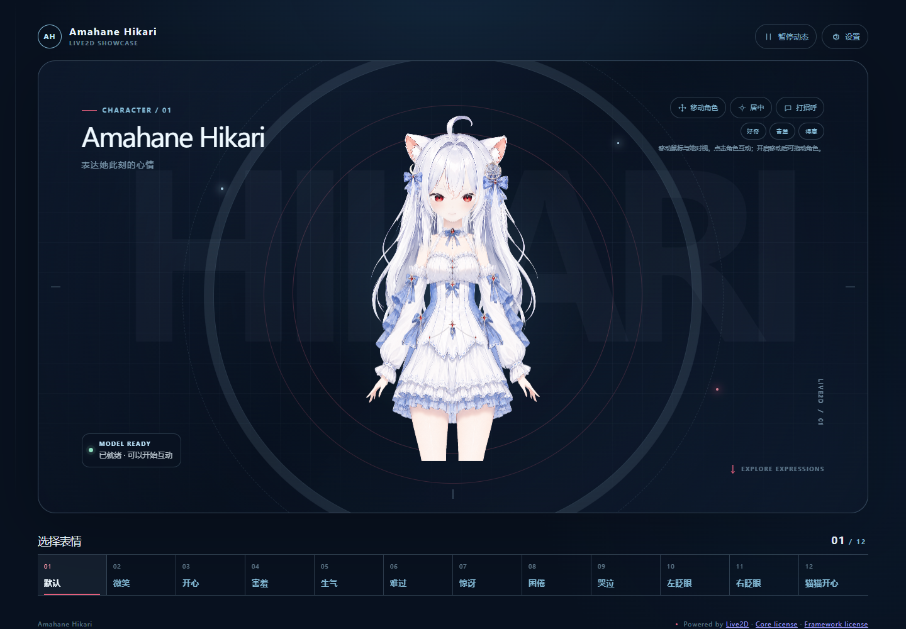

# Amahane Hikari · Live2D v2.0.0

[English](README.en.md) · [在线互动](https://live2d.luomo.moe/Amahane_Hikari/) · [发布仓库](https://github.com/luomo66ccff/Amahane-Hikari-Live2D)

银白长发、红瞳、白色兽耳与月雪主题的 Live2D 角色。v2.0.0 采用 native102 运行模型，提供三套服装、12 种表情和可复现的网页互动源码。



项目展示名称为 **Amahane Hikari**；制作文件沿用 **苏绛雪 / SuJiangXue** 的历史名称，以保持 Cubism 与运行资源的相对引用。

## 当前发布

| 项目 | 内容 |
| --- | --- |
| 原生版本 | native102；可编辑工程为 `model/source/Cubism/SuJiangXue_HairFlow_WIP_t102.cmo3` |
| 运行资源 | `model/runtime/`，25 个文件、8 张纹理、66 个参数、226 个 drawable、59 个 part |
| 服装 | 礼装、校服、泳装；保持现有素材的上大腿范围 |
| 表情 | 默认、微笑、开心、害羞、生气、难过、惊讶、困倦、哭泣、左右眨眼、猫猫开心，共 12 种 |
| 网页动作 | 好奇、害羞、得意；左右闭口轻咀嚼；取消、重入、暂停、复位和口型交接 |
| 网页控制 | 视线跟随、点击反馈、拖动、缩放、换装、暂停、复位和响应式布局 |

原生运行包还保留一条演示 motion。其他 native102 静态样例见 `previews/native102-school.png`、`previews/native102-swim.png` 和 `previews/native102-mobile.png`。网页动作入口使用实际绑定的参数；参数 ID 存在本身不代表已经完成语义绑定，具体边界见 [验证说明](docs/VALIDATION.md)。

## 下载与使用模型

[v2.0.0 下载](https://github.com/luomo66ccff/Amahane-Hikari-Live2D/releases/tag/v2.0.0)包含运行包、可编辑 CMO3、三套服装的前后对照录像和发布清单。录像 before 为已升级头肩的 native101，after 为 native102 与最终控制器。

保持 `model/runtime/` 的目录结构，加载其中的 `SuJiangXue_HikariSmirk_t001.model3.json`。继续绑定时，用 Live2D Cubism Editor **5.3.01** 打开 `model/source/Cubism/SuJiangXue_HairFlow_WIP_t102.cmo3`，保存、重开并重新导出相关运行资源。

`model/source/Photoshop/` 中保留的 PSD 是制作来源和局部美术输入，并不代表三套服装的完整最终 PSD。模型、美术、贴图、绑定、表情和预览的修改与再分发必须遵守 [模型许可](LICENSES/Model-Attribution-NoAI-1.0.txt)。

## 本地运行网页

需要 Node.js **22.12+ 或 24**。Live2D SDK 不随仓库分发，请从 [Cubism SDK for Web 官方下载页](https://www.live2d.com/en/sdk/download/web/) 获取 **5-r.5**，阅读其官方条款并解压到本机目录。

```sh
git clone https://github.com/luomo66ccff/Amahane-Hikari-Live2D.git
cd Amahane-Hikari-Live2D/web
npm ci
npm run setup:sdk -- "/path/to/CubismSdkForWeb-5-r.5"
npm run dev
```

打开终端显示的 `/Amahane_Hikari/` 地址。Windows 下同样要为带空格的 SDK 路径加引号。安装脚本只从你提供的本地 SDK 复制需要的文件，不下载 SDK、不修改原 SDK 目录；目标文件存在且内容不一致时会停止。

构建和本地预览：

```sh
npm run build
npm run preview
```

构建前会校验并同步 `model/runtime/`。部署到其他路径时，可通过 `VITE_BASE` 设置 Vite base。发布自己构建的网站时，继续遵守 Live2D SDK 的第三方授权条款。

## 网页口型输入

网页提供短时口型输入事件，便于语音或其他外部控制器接入。事件只接受有限数值，不申请麦克风权限：

```js
window.dispatchEvent(new CustomEvent('hikari:mouth-input', {
  detail: { open: 0.2, form: 0, pucker: 0, ttlMs: 180 }
}));

// 清除外部口型输入
window.dispatchEvent(new CustomEvent('hikari:mouth-input', { detail: null }));
```

`open` 范围为 0–1，`form` 为 −1–1，`pucker` 为 0–1，`ttlMs` 默认 180ms、允许 1–1000ms。暂停会冻结最终画面，但 TTL 仍按墙钟过期；复位和销毁会清除输入。闭口轻咀嚼在活跃和取消过渡期间保持口型优先权，动作结束后再交回外部输入。

## 可复现验证

从 `web/` 执行：

```sh
npm run verify
npm run test:controller
npm run test:smoke -- http://127.0.0.1:5188/Amahane_Hikari/ ./reports/page-smoke
```

`verify` 检查资产清单和运行资源引用；`test:controller` 检查动作意图、取消、暂停、重入和复位；`test:smoke` 使用真实无头浏览器完成普通页面检查，验证网页入口、真实资源、表情、服装和生产构建中的 DEV 边界，不注入模型内部控制器。口型 handoff 与 TTL 由单独的浏览器所有权验收覆盖。首次运行 smoke 可执行 `npx playwright install chromium`；使用已安装 Edge 时可跳过并设置 `BROWSER_CHANNEL=msedge`。本地与公网最终各 62 项通过；连接方式和未覆盖项目见 [验证说明](docs/VALIDATION.md)。

## 目录

```text
model/source/Cubism/       可继续编辑的 native102 CMO3
model/source/Photoshop/    制作来源 PSD；不等同于三套服装的完整最终母版
model/runtime/             native102 的 MOC3、model3、physics3、CDI、纹理、表情和 motion
previews/                  native102 礼装、校服、泳装和窄屏样例；neutral.png 为历史预览
web/                       网页应用源码；SDK 和构建目录被忽略
scripts/                   SDK 设置、模型同步、清单校验和发布验证工具
ASSET_MANIFEST.json        资产身份与 SHA-256 清单
LICENSES/                  项目与模型授权文本
```

制作与发布流程见 [工作流](docs/WORKFLOW.md)，经验复盘见 [Lessons Learned](docs/LESSONS_LEARNED.md)，版本变化见 [发布说明](docs/RELEASE_NOTES.md)，素材来源见 [来源说明](docs/PROVENANCE.md)。

## 授权与署名

模型、美术、贴图、绑定、表情及预览采用 [Model Attribution and No-AI License 1.0](LICENSES/Model-Attribution-NoAI-1.0.txt)：允许商用、修改和再分发，但须署名、保留授权、标明修改，并禁止用于创建、训练、测试或改进 AI / 机器学习系统及相关数据集。它是附用途限制的 source-available 模型许可，不是 CC BY 或 OSI 标准开源许可。

自写网页代码、样式、HTML、SVG favicon 和工具采用 [MIT](LICENSES/MIT.txt)；文档文字采用 CC BY 4.0。建议署名：

> Amahane Hikari / 苏绛雪 — luomo66ccff，Model Attribution and No-AI License 1.0。来源：https://github.com/luomo66ccff/Amahane-Hikari-Live2D

Live2D Core、Framework、shader 和类型声明属于第三方 SDK，不随源码仓库或源模型下载包提供；生成的网页构建可能包含运行所需组件，并必须保留适用的第三方说明和授权。详见 [第三方说明](THIRD_PARTY_NOTICES.md)。
