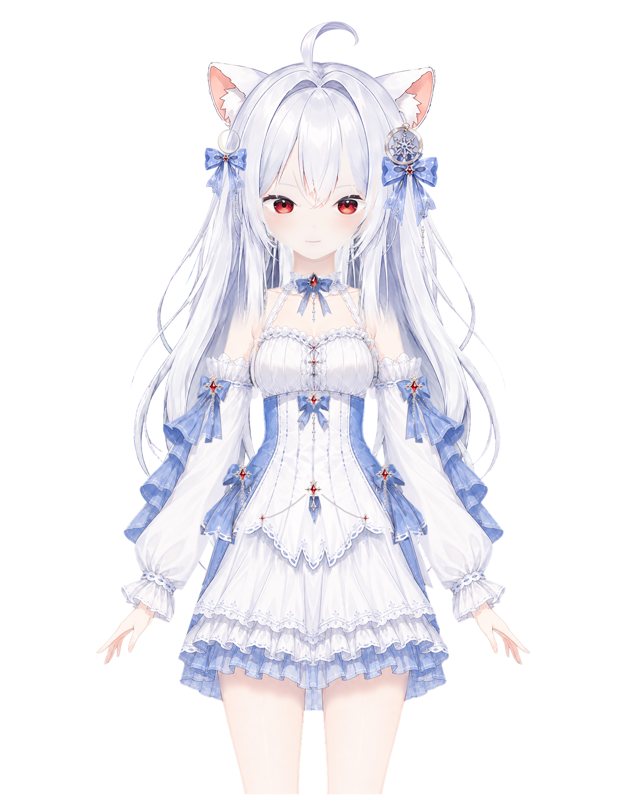

# Amahane Hikari · Live2D

[English](README.en.md) · [在线互动](https://live2d.luomo.moe/Amahane_Hikari/) · [下载运行包](https://github.com/luomo66ccff/Amahane-Hikari-Live2D/releases/latest)

银白长发、红瞳、白色兽耳与月雪主题的 Live2D 角色。这里公开当前模型的 Cubism 工程、Photoshop 母版、运行资源，以及带持续微风效果的网页展示源码。



项目展示名称为 **Amahane Hikari**；制作文件沿用 **苏绛雪 / SuJiangXue** 的历史名称，以保持 Cubism 和运行资源的相对引用。

## 下载与使用

- **使用模型**：下载 [Release](https://github.com/luomo66ccff/Amahane-Hikari-Live2D/releases/latest) 中的 Runtime ZIP，保持文件夹结构，加载 `SuJiangXue_HairFlow_t002.model3.json`。
- **继续绑定**：用 Live2D Cubism Editor **5.3.01** 打开 `model/source/Cubism/SuJiangXue_HairFlow_t001.cmo3`。
- **继续美术编辑**：打开 `model/source/Photoshop/` 中的 PSD。`ArtMaster_WIP` 是头发重绘母版，`BackHair_TexturePatch` 是两层后发导入补丁；文件名保留其制作范围。
- **获取完整源码**：克隆本仓库，或使用 GitHub 的 **Code → Download ZIP**。模型源工程是真实文件，不依赖 Git LFS。

## 当前效果

| 项目 | 内容 |
| --- | --- |
| 原生模型 | 48 个参数、182 个 ArtMesh / drawable |
| 原生物理 | 14 组、17 路输出，头发分段与左右肩臂响应 |
| 表情 | 默认、微笑、开心、害羞、生气、难过、惊讶、困倦、哭泣、左右眨眼、猫猫开心，共 12 种 |
| 网页互动 | 双眼追视、点击反馈、拖动、缩放、暂停、复位与移动布局 |
| 网页微风 | 六个既有头发参数，小幅持续摆动、发梢延迟、左右错开 |

微风由 `web/src/hair-breeze.ts` 与 `web/src/runtime.ts` 实现，叠加在网页的原生物理输出之后。单独加载 MOC3 时具有原生物理响应；网页的额外持续微风需要对应运行时代码。

当前 HairFlow 运行包已在 Cubism SDK for Web **5-r.5** 验证。它尚未在 VTube Studio 中重新导入，也没有本版本的摄像头面捕验收；请根据使用软件的 Core 兼容性自行测试或从 CMO3 导出。网页需要 **WebGL 2** 和 **8192 像素纹理**支持。

## 本地运行网页

需要 Node.js **22.12+ 或 24**。Live2D SDK 不随仓库分发，请从 [Live2D 官方下载页](https://www.live2d.com/en/sdk/download/web/) 获取 **Cubism SDK for Web 5-r.5**，阅读官方条款并解压。

```sh
git clone https://github.com/luomo66ccff/Amahane-Hikari-Live2D.git
cd Amahane-Hikari-Live2D/web
npm ci
npm run setup:sdk -- "/path/to/CubismSdkForWeb-5-r.5"
npm run dev
```

打开终端显示的 `/Amahane_Hikari/` 地址。Windows 同样可以把解压目录作为带引号的参数传入。安装脚本只从该本地目录复制所需 SDK 文件，不下载 SDK，不修改原 SDK 目录；已有文件字节不同会停止。

```sh
npm run build
npm run preview
```

构建前会校验并复制 `model/runtime/` 到网页的忽略目录。若部署到其他路径，通过 `VITE_BASE` 设置 Vite base。发布自己构建的网站时，继续遵守 Live2D SDK 的第三方授权条款。

从仓库根目录运行 `node scripts/verify-package.mjs` 可校验模型、PSD、预览的清单与相对资源引用。

## 目录

```text
model/source/Cubism/       可继续编辑的 CMO3
model/source/Photoshop/    头发美术母版与补丁 PSD
model/runtime/            MOC3、model3、physics3、CDI、贴图与表情
previews/                 原生中立态预览
web/                      网页应用源码；SDK 和构建目录被忽略
scripts/                  本地准备和校验工具
ASSET_MANIFEST.json        模型与预览的 SHA-256 清单
LICENSES/                 完整授权文本
```

## 授权与署名

**模型、美术、贴图、绑定、表情及预览采用 [Model Attribution and No-AI License 1.0](LICENSES/Model-Attribution-NoAI-1.0.txt)**：允许商用、修改和再分发；须署名、保留授权和标明修改；禁止用于创建、训练、测试或改进 AI / 机器学习系统及相关数据集。模型属于附用途限制的源码公开，并非 CC BY 或 OSI 标准开源许可。建议署名：

> Amahane Hikari / 苏绛雪 — luomo66ccff，Model Attribution and No-AI License 1.0。来源：https://github.com/luomo66ccff/Amahane-Hikari-Live2D

**自写网页代码及工具采用 [MIT](LICENSES/MIT.txt)**；文档文字采用 CC BY 4.0。素材制作流程包含 AI 辅助与 Firefly 生成内容，详见 [制作来源说明](docs/PROVENANCE.md)。Live2D SDK 保留官方授权，见 [第三方说明](THIRD_PARTY_NOTICES.md)。制作及验证范围见 [版本说明](docs/RELEASE_NOTES.md)。
