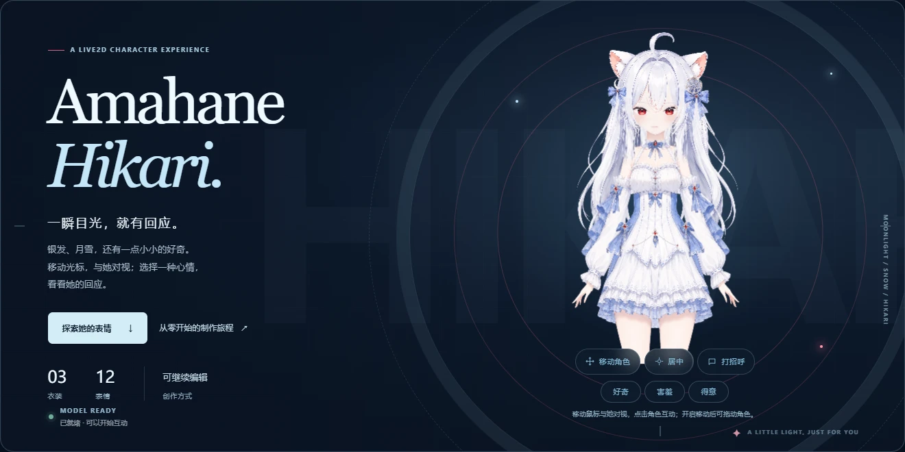
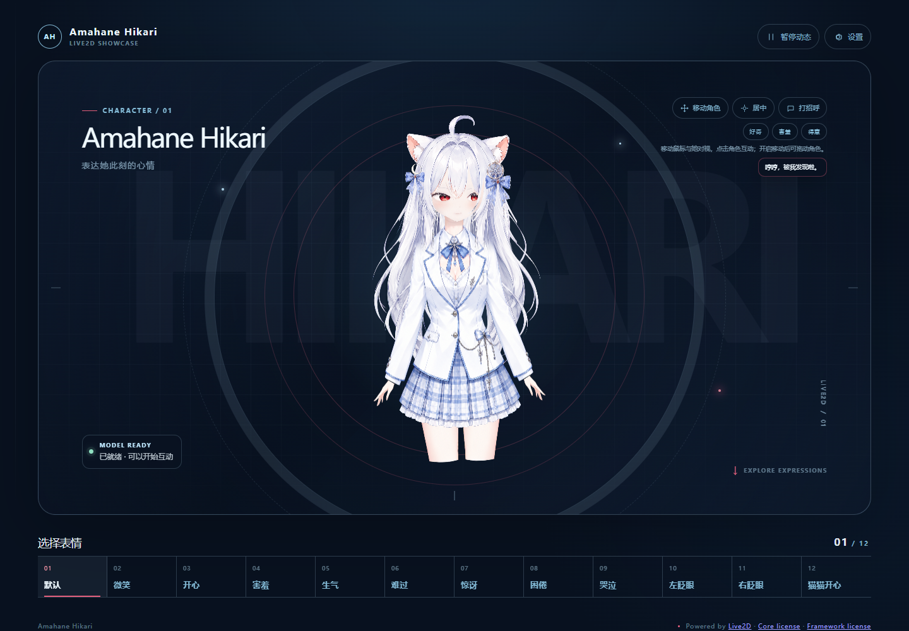
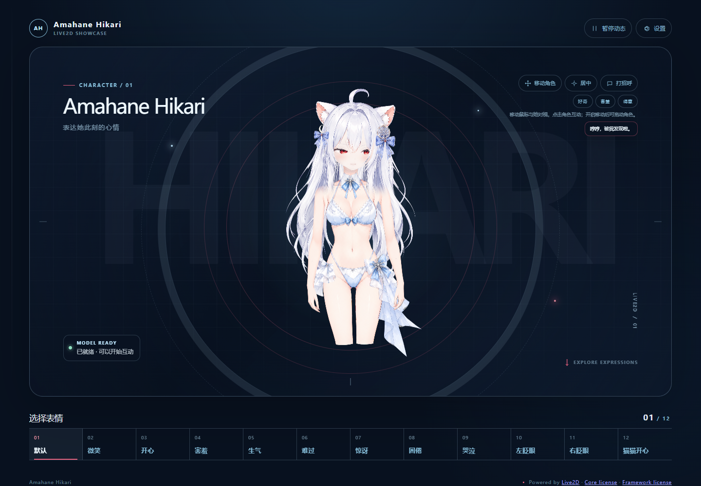

# Amahane Hikari · Live2D v2.1.0

[简体中文](README.md) / [English](README.en.md)

[](https://github.com/luomo66ccff/Amahane-Hikari-Live2D/actions/workflows/sdk-free-regression.yml)

月雪、冰蓝色调的 Live2D 角色与一套可复用的 TypeScript/Vite 运行时。仓库同时保留网页源码、动作与口型输入、可复现检查、模型制作 Skill，以及可继续编辑的模型文件。

[在线试玩](https://live2d.luomo.moe/Amahane_Hikari/) · [模型下载（v2.0.0）](https://github.com/luomo66ccff/Amahane-Hikari-Live2D/releases/tag/v2.0.0) · [制作 Skill 源码](skills/live2d-end-to-end/SKILL.md) · [Skill 包（v2.0.1）](https://github.com/luomo66ccff/Amahane-Hikari-Live2D/releases/tag/v2.0.1) · [参与贡献](CONTRIBUTING.md) · [安全披露](SECURITY.md)

<p align="center">
  
</p>

<details>
<summary>查看三套服装的静态预览</summary>

<p align="center">
  <a href="previews/native102-dress.png"></a>
  <a href="previews/native102-school.png"></a>
  <a href="previews/native102-swim.png"></a>
</p>

</details>

## 这个仓库是什么

Amahane Hikari 把一个真实的 Live2D Cubism 角色带进浏览器，并公开实现它的代码与制作流程。你可以研究动作控制器、复现加载与资源清理问题，也可以用制作 Skill 开始自己的角色项目。

软件与工具采用 MIT，文档采用 CC BY 4.0；角色资产采用独立的 Attribution + No-AI 许可，属于 source-available。各部分的使用范围见[许可说明](#许可与署名)。

维护者：`luomo66ccff`。代码协作辅助：Hermes（`Amahane-Hikari`）。

## 当前内容

| 部分 | 已提交内容 |
| --- | --- |
| 网页运行时 | TypeScript/Vite、WebGL 2、Cubism Core/Framework 接入、响应式控制台 |
| 角色互动 | 12 个表情、礼装/校服/泳装三套服装、视线跟随、点击反馈、拖动、缩放、暂停和复位 |
| 动作系统 | `curiosity`、`shy`、`smug` 三个网页动作；控制器还保留 `chewLeft` / `chewRight` 的口型交接边界 |
| 外部输入 | `hikari:mouth-input` 短时口型事件；不申请麦克风权限 |
| 制作 Skill | 从素材检查、Photoshop 门禁、Cubism 绑定到运行时验收和回退的可复用流程 |
| 可复现检查 | 不需要 SDK 的控制器、运行时替身、资源清理和 DOM 事件检查；真实模型网页检查另需 SDK |

当前模型为 `native102`。源文件仍使用历史名称 `SuJiangXue / 苏绛雪`，以保持 Cubism 工程和运行资源引用稳定。美术目前延伸到大腿上部；预览不能推断出小腿或脚部内容。

## 先跑不需要 SDK 的检查

Node.js 需要满足 `web/package.json` 中的要求，即 **22.12+**。依赖安装和以下检查都在 `web/` 中进行：

```sh
git clone https://github.com/luomo66ccff/Amahane-Hikari-Live2D.git
cd Amahane-Hikari-Live2D/web
npm ci
npm test
npx playwright install chromium
npm run test:events
```

`npm test` 运行动作控制器、时间步进、口型 TTL、暂停/复位、资源清理等 SDK-free 回归；它使用 TypeScript 转译和明确的运行时替身，不渲染真实模型。`npm run test:events` 使用真实 Chromium 检查 `main.ts` 的 DOM 事件注册和 README 中的口型示例，也不加载 SDK 或模型。Chromium 只需安装一次；若使用本机 Edge，可设置 `BROWSER_CHANNEL=msedge` 后运行同一命令。

资产清单和运行资源引用可以单独检查：

```sh
npm run verify
```

## 本地运行网页

v2.1.0 更新了项目首页、静态预览与贡献文档。可编辑模型包见 v2.0.0，独立 Skill 包见 v2.0.1；各版内容和验证范围见[发布记录](docs/RELEASE_NOTES.md)。

完整网页需要你从 [Live2D 官方 Cubism SDK for Web 下载页](https://www.live2d.com/en/sdk/download/web/) 获取 **5-r.5**，阅读并遵守其官方条款，再把 SDK 解压到本机目录。SDK、Core、Framework、shader 和类型声明不随本仓库分发。

从 `web/` 执行：

```sh
npm run setup:sdk -- "/path/to/CubismSdkForWeb-5-r.5"
npm run dev
```

打开 Vite 输出的 `http://127.0.0.1:5188/Amahane_Hikari/`。Windows 路径同样建议加引号。设置脚本会检查 SDK 中的 `cubism-info.yml` 是否为 `5-r.5`，只复制运行所需文件到被忽略的 `web/vendor/`、`web/public/vendor/`、`web/public/licenses/`；不会修改你的 SDK 源目录，也不会下载 SDK。

构建和本地预览：

```sh
npm run build
npm run preview
```

`dev`、`build` 和 `preview` 会先校验模型并准备网页专用资源，所以完整网页路径必须先完成 SDK 设置。默认 Vite base 是 `/Amahane_Hikari/`；部署到其他路径时可设置 `VITE_BASE`。网页专用纹理由构建脚本生成并放入被忽略目录，原始 PNG、MOC3 和 CMO3 不会被改写。要做真实页面 smoke 检查，可在另一个终端运行：

```sh
npm run test:smoke -- http://127.0.0.1:5188/Amahane_Hikari/ ./reports/page-smoke
npm run test:project-page -- http://127.0.0.1:5188/Amahane_Hikari/ ./reports/project-page
```

该检查使用 `npm run build` 后的 `npm run preview` 生产预览服务、浏览器和本地 SDK 生成的网页资源。它还检查生产构建中没有开发调试接口，因此不要针对 `npm run dev` 运行。结果覆盖报告中列出的浏览器、视口与操作。

## 口型输入

外部控制器可以向 `window` 分发短时口型事件。`open` 的范围是 `0–1`，`form` 是 `−1–1`，`pucker` 是 `0–1`；`ttlMs` 默认 `180` 毫秒，允许 `1–1000` 毫秒。传入 `null` 会清除当前输入。详细所有权和动作交接边界见[架构说明](docs/ARCHITECTURE.md)。

<details>
<summary>最小发送与清除示例</summary>

```js
window.dispatchEvent(new CustomEvent('hikari:mouth-input', {
  detail: { open: 0.2, form: 0, pucker: 0, ttlMs: 180 }
}));

// 清除外部口型输入
window.dispatchEvent(new CustomEvent('hikari:mouth-input', { detail: null }));
```

</details>

## 目录

```text
model/runtime/             native102 运行资源：model3、MOC3、physics、表情、motion、纹理
model/source/Cubism/       可继续编辑的 CMO3；文件名保留 SuJiangXue 历史名称
model/source/Photoshop/    制作来源和局部补丁，不是三套服装的完整最终 PSD
previews/                  角色预览；OSS 门面图和各服装样例
web/src/                   UI、运行时、动作、口型、姿态和辅助模块
scripts/                   SDK 设置、模型同步、清单校验和浏览器检查
skills/                    可移植的 Live2D 制作 Skill
LICENSES/                  MIT、CC BY 4.0 和模型许可文本
ASSET_MANIFEST.json        模型与预览文件的身份及 SHA-256 清单
```

技术边界和参数管线见[架构说明](docs/ARCHITECTURE.md)，尚未承诺日期的待办见[路线图](docs/ROADMAP.md)。制作、发布和证据边界见[工作流](docs/WORKFLOW.md)、[验证说明](docs/VALIDATION.md)、[来源说明](docs/PROVENANCE.md)和[第三方说明](THIRD_PARTY_NOTICES.md)。

## 许可与署名

| 内容 | 许可 | 说明 |
| --- | --- | --- |
| 原创网页代码、样式、HTML、SVG favicon 和工具 | [MIT](LICENSES/MIT.txt) | 以仓库中各文件的 SPDX 标记和许可文本为准 |
| 文档与 Skill 文字 | [CC BY 4.0](LICENSES/CC-BY-4.0.txt) | 转载或改编时保留署名、许可链接和修改说明 |
| 模型、美术、贴图、绑定、表情、源 CMO3/PSD 和预览 | [Model Attribution and No-AI License 1.0](LICENSES/Model-Attribution-NoAI-1.0.txt) | 允许范围、署名、修改标记和 AI/ML 限制以该文件为准；这是 custom source-available 许可，不是 OSI 开源许可 |
| Live2D Core、Framework、shader 和类型声明 | Live2D 官方条款 | SDK 独立授权，由使用者自行获取；生成网页构建若包含 SDK 组件，必须保留适用的第三方说明 |

再分发模型或衍生模型时，请保留许可并使用以下署名：

> Amahane Hikari / SuJiangXue — luomo66ccff，Model Attribution and No-AI License 1.0。来源：https://github.com/luomo66ccff/Amahane-Hikari-Live2D

模型许可禁止把这些模型材料或其衍生数据用于创建、训练、测试或改进 AI/机器学习系统及相关数据集。代码贡献、文档翻译和模型资产修改的边界不同，提交前请阅读 [CONTRIBUTING.md](CONTRIBUTING.md)。
