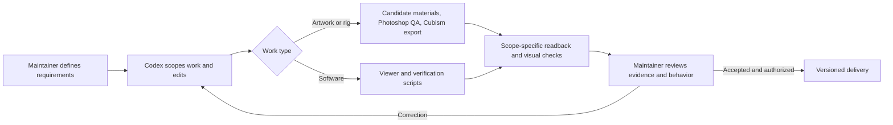

# How AI built Amahane Hikari

[English](AI_DEVELOPMENT.md) / [简体中文](AI_DEVELOPMENT.zh-CN.md)

**AI-led execution, human direction and acceptance.** Amahane Hikari is a practical record of using OpenAI Codex agents to turn iterative creative requirements into an editable Live2D character, a working web viewer and reusable production tools. Codex participates in planning, code generation, tool orchestration, debugging, tests and documentation. The maintainer, `luomo66ccff`, supplies requirements and visual feedback, decides what to accept, and authorizes publication.

AI generation also appears in the artwork: the retained production account identifies Adobe Firefly-generated hair, eye-component and accessory material. This is distinct from Codex's engineering role. The final character still goes through Photoshop preparation, Cubism rigging and export, and runtime validation.

## 90-second evidence tour

1. Open the [evidence index](ai-evidence.json) to separate production-history attribution, inspectable code/assets, SDK-free checks and finite real-browser results.
2. Read the [texture-loading case below](#case-study-from-loading-feedback-to-reusable-tools) alongside the [measurement conditions](WEB_PERFORMANCE.md) and [machine-readable result](web-performance.json).
3. Inspect the [fixed implementation commit](https://github.com/luomo66ccff/Amahane-Hikari-Live2D/commit/ee9bf2cc917aa610b8773bd0500d1ba9160de3ba), [encoder](../scripts/prepare-web-model.mjs) and [recovery check](../scripts/test-loading.mjs). The commit shows a change; it does not by itself certify who generated each line.



This is the project workflow, not a claim that every case used every stage or that a Git author name proves AI authorship. The [change-record template](templates/AI_CHANGE_RECORD.md) keeps future task evidence and human corrections explicit without publishing private conversations.

## Responsibilities and outputs

| Stage | AI execution | Maintainer's role | Public output |
| --- | --- | --- | --- |
| Requirements and planning | Decompose creative feedback into bounded artwork, rigging, runtime and validation tasks | Define identity, style, motion preferences and acceptable scope | [Production workflow](WORKFLOW.md), [production Skill](../skills/live2d-end-to-end/SKILL.md) |
| Artwork generation and preparation | Work with generated component candidates; organize transparency, registration, occlusion and layer checks | Select direction and give visual corrections | [Provenance](PROVENANCE.md), [retained Photoshop inputs](../model/source/Photoshop) |
| Editable model production | Plan and orchestrate editor work, parameter/physics changes, export and readback checks | Decide whether motion and appearance meet the intended result | [Cubism source](../model/source/Cubism), [runtime export](../model/runtime), [validation record](VALIDATION.md) |
| Software implementation | Generate and revise TypeScript, HTML/CSS, motion controllers, loading logic and build/verification scripts | Request interactions, report undesirable behavior and accept the outcome | [Viewer source](../web/src), [scripts](../scripts), [architecture](ARCHITECTURE.md) |
| Debugging and verification | Reproduce failures, inspect artifacts, implement fixes, execute checks and preserve failed candidates | Supply corrections and decide whether the result is ready to use | [Lessons learned](LESSONS_LEARNED.md), [CI](../.github/workflows/sdk-free-regression.yml) |
| Documentation and release | Prepare bilingual documentation, package manifests, deployment checks and a reusable Skill | Retain project ownership and approve external release actions | [Release history](https://github.com/luomo66ccff/Amahane-Hikari-Live2D/releases), [Skill](../skills/live2d-end-to-end) |

“AI-led” describes the execution workflow, not a measured percentage of generated lines or pixels. It does not mean that a single prompt produced the finished model or that every change received line-by-line human review. Hermes (`Amahane-Hikari`) is the assistant contributor identity used for some commits, not a separate model name or a certificate of AI authorship.

## Start with four concrete changes

These fixed commits make the engineering work inspectable. Diffs and tests establish what changed; the project provenance statement explains how AI participated.

1. **Publish an editable model and its implementation.** [Commit `e73e316`](https://github.com/luomo66ccff/Amahane-Hikari-Live2D/commit/e73e3162cd054c686caad238abb605a392c59bfb) publishes the native102 Cubism source, runtime export, action controller, viewer and production/validation records. This is the central inspectable model-and-software delivery.
2. **Reduce texture transfer without changing the original model.** [Commit `ee9bf2c`](https://github.com/luomo66ccff/Amahane-Hikari-Live2D/commit/ee9bf2cc917aa610b8773bd0500d1ba9160de3ba) adds web texture preparation and bounded loading. Eight textures go from 45,967,274 PNG bytes to 13,336,594 WebP bytes, with decoded RGBA equality checks. See [the measurement conditions](WEB_PERFORMANCE.md) and [the encoder](../scripts/prepare-web-model.mjs).
3. **Turn production experience into a reusable Skill.** [Commit `9db9bc7`](https://github.com/luomo66ccff/Amahane-Hikari-Live2D/commit/9db9bc776af980cfef4d21c6980ceae5ba4f1321) publishes the artwork-to-Cubism-to-browser workflow, its correction/recovery references and portable package checks. Readers can inspect and adapt the [Skill source](../skills/live2d-end-to-end/SKILL.md).
4. **Make the character and the project usable during loading.** [Commit `251ef1e`](https://github.com/luomo66ccff/Amahane-Hikari-Live2D/commit/251ef1ebcc4c150800d748df1575fa4c71ac3502), merged through [PR #4](https://github.com/luomo66ccff/Amahane-Hikari-Live2D/pull/4), adds the responsive homepage, real-model static preview, contributor guides and [35 page checks](../scripts/check-project-page.mjs). The native102 model and core renderer/runtime source files remain unchanged by that presentation update.

## Case study: from loading feedback to reusable tools

| Step | Inspectable record |
| --- | --- |
| Need | The recorded cold/warm model-ready times were 70.03/35.82 seconds, with 45,967,274 bytes of source PNG textures. This was a fixed-network performance problem, not a reason to alter the native102 rig. [Conditions and limitations](WEB_PERFORMANCE.md) |
| Codex execution | The project records agent-led implementation. [Web-only texture preparation](../scripts/prepare-web-model.mjs) encodes lossless, exact-alpha WebP and checks decoded RGBA; [runtime loading](../web/src/runtime.ts) bounds parallel texture work and uses versioned cache/fallback behavior; [loading recovery checks](../scripts/test-loading.mjs) exercise failure paths. [Commit diff](https://github.com/luomo66ccff/Amahane-Hikari-Live2D/commit/ee9bf2cc917aa610b8773bd0500d1ba9160de3ba) shows the published source changes. |
| Failure and correction | The earlier cache rule missed versioned `model/hikari_t001`; a large texture could also miss the HTTP cache on revisit. The final version uses `hikari-textures-hikari_t002` Cache Storage, retains network fallback, and removes a corrupt cached response before retry. Earlier remote timeouts and a failed cache-header rollout remain documented rather than being counted as successes. [Failure account](WEB_PERFORMANCE.md#实现与纠正) |
| Measured result | Eight textures became 13,336,594 WebP bytes; the recorded final cold/warm model-ready times were 16.48/2.61 seconds. The [summary data](web-performance.json) is one before and one after cold/warm pair on one machine under forced HTTP/1.1, not field performance or a universal speed guarantee. No task-level record of individual human review steps is published. |
| Reuse | Keep canonical model assets intact, verify decoded pixels, version generated URLs and test storage/network failure separately. The [encoder](../scripts/prepare-web-model.mjs), [recovery script](../scripts/test-loading.mjs) and [measurement script](../scripts/measure-load.mjs) can be adapted with their stated SDK/browser prerequisites. |

To rerun the bounded recovery check, set up the local SDK and production preview as in the [viewer instructions](../README.en.md#run-the-complete-viewer), then use a fresh report directory from the repository root:

```sh
node scripts/test-loading.mjs http://127.0.0.1:5188/Amahane_Hikari/ reports/loading-recovery-new
```

The [evidence index](ai-evidence.json) distinguishes reported production attribution from inspectable changes. Its regression entry identifies SDK-free contracts (some with doubles, some in a browser without a model); its loading entry identifies finite SDK-backed browser measurements. None supplies a measured AI-generated percentage.

## How feedback became fixes

| Feedback or failure | Correction | Evidence and reusable lesson |
| --- | --- | --- |
| The swimsuit arms moved too far and looked jointed, like a doll | Constrain movement toward small shoulder-led sway; correct the connection using continuous artwork and inspect combinations | [Model/artwork lessons](LESSONS_LEARNED.md#模型与美术), [runtime/acceptance reference](../skills/live2d-end-to-end/references/runtime-and-acceptance.md). A large parameter range is not proof of good motion. |
| Rapid action clicks could disappear behind a throttled status message | Separate action dispatch from informational announcement throttling | [UI action handler](../web/src/ui.ts), [ownership lessons](LESSONS_LEARNED.md#交互所有权). The command and its notification have different responsibilities. |
| A native102 edit had already moved points when the reporting script failed | Read the actual point state independently and repair the report instead of repeating the displacement | [Two concrete debugging examples](LESSONS_LEARNED.md#两个具体的排错例子). A reporting failure does not prove that the editor operation failed. |
| Slow model downloads left the first screen without a character | Use a real renderer capture as a labeled static preview; preserve documentation and offer retry on failure | [Page check](../scripts/check-project-page.mjs), [v2.1.0 notes](RELEASE_NOTES.md). Test what visitors see before and after recovery. |

The model-edit cases above are documented production retrospectives. Their final editable/exported artifacts are public; raw workstation logs and all intermediate failed candidates are not bundled into this repository.

## Reproduce the software checks

The useful outputs of the AI workflow are inspectable code, checks and repeatable instructions. From `web/`, after cloning the repository and installing Node.js 22.12+:

```sh
npm ci
npm test
npx playwright install chromium
npm run test:events
npm run verify
```

The existing SDK-free suites cover 21 controller cases, 14 runtime-contract cases, 17 resource-cleanup cases and two sets of 9 DOM-event cases: **70 checks**. These tests include explicit doubles; they do not render a real model. [GitHub Actions](https://github.com/luomo66ccff/Amahane-Hikari-Live2D/actions/workflows/sdk-free-regression.yml) runs the same suites.

For real rendering, obtain the SDK separately and follow the [viewer setup](../README.en.md#run-the-complete-viewer). After building and starting the production preview, run `npm run test:smoke` and `npm run test:project-page` with the preview URL and a fresh report directory. The [release notes](RELEASE_NOTES.md) state the recorded browser/viewport coverage. Test counts are bounded evidence, not a score for the quality of AI generation.

## What is generated, and what is captured

- **Generated artwork components:** the production record identifies Adobe Firefly material. It does not map every final pixel to a prompt, seed, source layer or exact model version; those details must not be reconstructed as if they were recorded.
- **Code and documentation:** Codex agents generate and revise implementations, scripts and written instructions. Commit history preserves changes and attributed contributors, but there is no audited per-line AI-generation percentage.
- **Editable model files:** CMO3 and the runtime package are outputs of real Cubism editing and export. An image candidate, JSON parameter list or screenshot alone does not establish a completed rig.
- **Project previews:** the current poster is a capture of the real native102 renderer; the cover and social image are browser screenshots. They are not new AI-generated promotional artwork.

The public record is designed to be reproducible without exposing private conversations, account identifiers, credentials or unlicensed SDK contents.

## What other maintainers can reuse

The MIT viewer and tools expose motion ownership, cancellation, frame timing, bounded loading and cleanup patterns. The CC BY 4.0 Skill and documentation share stage gates, reproduction steps and recovery lessons. Future Codex work can build on these to reproduce reported bugs, extend cancellation/load-failure coverage, improve model adaptation guidance and keep translations aligned with actual behavior. Planned work remains in the [roadmap](ROADMAP.md).

## Next Codex maintenance tasks

These three tasks are **planned**, not completed features or promised dates:

| Task and starting paths | Deliverable | Acceptance boundary |
| --- | --- | --- |
| Adapt another model: [runtime capabilities](../web/src/runtime-capabilities.ts), [package checker](../skills/live2d-end-to-end/scripts/verify_model_package.py), [roadmap](ROADMAP.md#model-adaptation-guide) | A capability matrix and DEV-only model-loading example, with required and unsupported channels stated | Package references close; a real model's parameter ranges and affected browser poses are read back. A matching ID alone is not compatibility. |
| Extend loading recovery: [runtime](../web/src/runtime.ts), [retry lifecycle](../web/src/main.ts), [current fault injection](../scripts/test-loading.mjs) | Focused scenarios for interrupted model/shader/texture loads, retry, context loss and hidden-tab return | Record user-visible state and cleanup after each injected failure in a real browser; SDK-free doubles remain a separate layer. |
| Publish copyable mouth-input examples: [public listener](../web/src/main.ts), [DOM event test](../scripts/test-mouth-event.mjs), [roadmap](ROADMAP.md#public-runtime-examples) | A short JavaScript/TypeScript example with input limits, expiry and clear behavior | Run the DOM contract check and, for visible mouth movement, an SDK-backed browser check; do not imply microphone or universal model support. |

Codex is a development tool in this project. The published viewer uses Live2D/WebGL and does not require an OpenAI API key. Software and tools are MIT; documentation is CC BY 4.0; character assets and previews have separate [Model Attribution and No-AI terms](../LICENSES/Model-Attribution-NoAI-1.0.txt). Artwork generation provenance does not remove those downstream restrictions, and the model's license does not replace the MIT license of the code. The SDK follows its own upstream terms.
