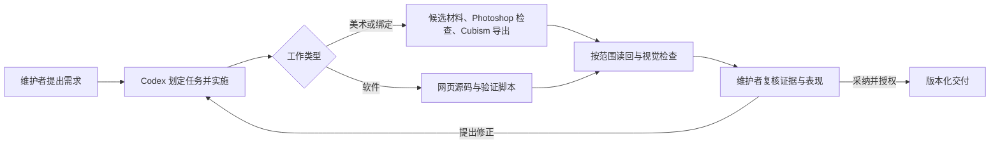

# AI 如何制作与开发 Amahane Hikari

[简体中文](AI_DEVELOPMENT.zh-CN.md) / [English](AI_DEVELOPMENT.md)

**AI 主导执行，人类确定方向与验收。** Amahane Hikari 记录了使用 OpenAI Codex 代理，把不断迭代的创作需求落实成可编辑 Live2D 角色、可运行网页和可复用工具的过程。Codex 参与规划、代码生成、工具编排、排错、测试与文档；维护者 `luomo66ccff` 提供需求和视觉反馈，决定采纳结果并授权发布。

AI 生成也体现在美术材料中：已有制作记录明确记载 Adobe Firefly 生成的发丝、眼部组件和饰品材料。这与 Codex 的工程开发职责不同。最终角色仍需经过 Photoshop 素材处理、Cubism 绑定与导出，以及运行时验收。

## 90 秒核查路线

1. 先看[证据索引](ai-evidence.json)，区分制作史归因、可检查代码与制品、SDK-free 检查及有限真实浏览器结果。
2. 对照下方的[纹理加载案例](#案例从加载反馈到可复用工具)、[测量条件](WEB_PERFORMANCE.md)与[机器可读结果](web-performance.json)。
3. 再看[固定实现提交](https://github.com/luomo66ccff/Amahane-Hikari-Live2D/commit/ee9bf2cc917aa610b8773bd0500d1ba9160de3ba)、[编码脚本](../scripts/prepare-web-model.mjs)和[恢复测试](../scripts/test-loading.mjs)。提交能证明改动，不能单独认证每行代码由谁生成。



这是项目工作流，不表示每个案例都经过所有阶段，也不把 Git 署名当作 AI 作者认证。后续任务可用[变更记录模板](templates/AI_CHANGE_RECORD.md)记录实际 AI 执行与人工纠正，而不公开私人对话。

## 各阶段由谁完成什么

| 阶段 | AI 执行内容 | 维护者职责 | 公开成果 |
| --- | --- | --- | --- |
| 需求与规划 | 将创作反馈拆成有范围的美术、绑定、运行时和验证任务 | 确定角色身份、风格、动作偏好和改动范围 | [制作流程](WORKFLOW.md)、[制作 Skill](../skills/live2d-end-to-end/SKILL.md) |
| 素材生成与准备 | 处理生成组件候选，组织透明度、配准、遮挡和分层检查 | 选择方向，提出视觉修正 | [来源说明](PROVENANCE.md)、[保留的 Photoshop 输入](../model/source/Photoshop) |
| 可编辑模型制作 | 规划并编排编辑器操作、参数与物理调整、导出和读回检查 | 判断动作和外观是否符合预期 | [Cubism 工程](../model/source/Cubism)、[运行包](../model/runtime)、[验收记录](VALIDATION.md) |
| 软件实现 | 生成并调整 TypeScript、HTML/CSS、动作控制、加载逻辑与构建/校验脚本 | 提出交互需求、指出问题并采纳成果 | [网页源码](../web/src)、[脚本](../scripts)、[架构](ARCHITECTURE.md) |
| 排错与验证 | 复现失败、检查制品、实现修复、运行检查并保留失败候选 | 提供修正意见，决定结果是否可用 | [经验复盘](LESSONS_LEARNED.md)、[CI](../.github/workflows/sdk-free-regression.yml) |
| 文档与发布 | 整理双语说明、文件清单、部署检查和可复用 Skill | 保有项目所有权，授权对外发布 | [发布历史](https://github.com/luomo66ccff/Amahane-Hikari-Live2D/releases)、[Skill](../skills/live2d-end-to-end) |

“AI 主导”描述的是执行工作流，不是经过统计的代码或像素生成比例。它不表示一条提示词就完成了模型，也不表示每一行改动都经过人工逐行检查。Hermes（`Amahane-Hikari`）是部分提交使用的助手协作身份，不是另一个模型名称，也不是 AI 来源认证。

## 先看四项可核查的改动

以下固定提交可以查看实际工程变化；差异和测试证明改了什么，项目来源说明解释 AI 如何参与。

1. **交付可编辑模型及其实现。** [提交 `e73e316`](https://github.com/luomo66ccff/Amahane-Hikari-Live2D/commit/e73e3162cd054c686caad238abb605a392c59bfb)发布 native102 Cubism 源工程、运行包、动作控制器、网页及制作/验证记录，是可以直接检查的核心模型与软件交付。
2. **减少纹理传输，保留原始模型。** [提交 `ee9bf2c`](https://github.com/luomo66ccff/Amahane-Hikari-Live2D/commit/ee9bf2cc917aa610b8773bd0500d1ba9160de3ba)加入网页纹理准备和受控加载。8 张 PNG 共 45,967,274 字节，网页 WebP 共 13,336,594 字节，并检查解码 RGBA 一致。见[测量条件](WEB_PERFORMANCE.md)和[编码脚本](../scripts/prepare-web-model.mjs)。
3. **把制作过程提炼成可复用 Skill。** [提交 `9db9bc7`](https://github.com/luomo66ccff/Amahane-Hikari-Live2D/commit/9db9bc776af980cfef4d21c6980ceae5ba4f1321)发布从美术到 Cubism、网页运行的流程，以及纠错/恢复参考和可移植检查脚本。读者可以直接研究并改编 [Skill 源码](../skills/live2d-end-to-end/SKILL.md)。
4. **让加载中的角色和项目仍然可见、可用。** [提交 `251ef1e`](https://github.com/luomo66ccff/Amahane-Hikari-Live2D/commit/251ef1ebcc4c150800d748df1575fa4c71ac3502)经 [PR #4](https://github.com/luomo66ccff/Amahane-Hikari-Live2D/pull/4)合入，新增响应式首页、真实模型静态预览、贡献说明和 [35 项页面检查](../scripts/check-project-page.mjs)。这次展示更新保留了 native102 与核心渲染/运行时源文件。

## 案例：从加载反馈到可复用工具

| 步骤 | 可核查记录 |
| --- | --- |
| 需求 | 记录中的冷/热模型就绪时间为 70.03/35.82 秒，源 PNG 纹理共 45,967,274 字节。这是固定网络条件下的加载问题，不需要改变 native102 原生绑定。[条件与限制](WEB_PERFORMANCE.md) |
| Codex 执行 | 项目记录将实现归于代理主导的工程工作。[网页专用纹理脚本](../scripts/prepare-web-model.mjs)生成无损、保留透明度的 WebP 并检查解码 RGBA；[运行时加载](../web/src/runtime.ts)限制纹理并行任务，处理版本化缓存及回退；[加载恢复测试](../scripts/test-loading.mjs)覆盖失败路径。[提交差异](https://github.com/luomo66ccff/Amahane-Hikari-Live2D/commit/ee9bf2cc917aa610b8773bd0500d1ba9160de3ba)可查看已发布源码。 |
| 失败与修正 | 早期缓存规则漏掉版本化的 `model/hikari_t001`；大纹理复访也可能不命中 HTTP 缓存。最终版使用 `hikari-textures-hikari_t002` Cache Storage，同时保留网络回退，并在缓存内容解码失败时移除该项供重试。历史远端超时和一次缓存响应头部署失败仍保留记录，没有改算为成功。[纠正经过](WEB_PERFORMANCE.md#实现与纠正) |
| 实测结果 | 8 张纹理的 WebP 总计 13,336,594 字节；记录的最终冷/热模型就绪时间为 16.48/2.61 秒。[摘要数据](web-performance.json)来自同一台机器在强制 HTTP/1.1 下前后各一组冷/热样本，不是用户现场指标或普遍速度保证。仓库没有公开逐步人工审查该任务的记录。 |
| 复用价值 | 保留原始模型资产、校验解码像素、为生成资源使用版本化 URL，并分别验证存储和网络失败。[编码脚本](../scripts/prepare-web-model.mjs)、[恢复脚本](../scripts/test-loading.mjs)及[测量脚本](../scripts/measure-load.mjs)可在各自 SDK/浏览器前提下改编。 |

要复跑有限的加载恢复检查，先按[网页说明](../README.md#本地运行网页)准备本地 SDK 和生产预览，再从仓库根目录使用新报告目录：

```sh
node scripts/test-loading.mjs http://127.0.0.1:5188/Amahane_Hikari/ reports/loading-recovery-new
```

[证据索引](ai-evidence.json)区分制作记录归因与可检查改动；其中回归条目注明 SDK-free 契约检查（部分使用替身，部分使用不加载模型的浏览器），加载条目注明有限的 SDK 支撑浏览器测量。任何一层都不是经统计的 AI 生成占比。

## 反馈如何变成修复

| 反馈或失败 | 纠正方法 | 证据与可复用经验 |
| --- | --- | --- |
| 泳装手臂运动过大，接缝像人偶 | 将运动约束为小幅肩部带动，配合连续画稿修正连接并检查组合姿态 | [模型与美术复盘](LESSONS_LEARNED.md#模型与美术)、[运行时验收参考](../skills/live2d-end-to-end/references/runtime-and-acceptance.md)。参数范围大不等于动作自然。 |
| 快速点击动作会被状态提示节流吞掉 | 分开动作派发与信息提示节流 | [UI 动作处理](../web/src/ui.ts)、[交互所有权复盘](LESSONS_LEARNED.md#交互所有权)。命令和通知各有职责。 |
| native102 的点位编辑已发生，随后报告脚本失败 | 独立读回真实点位，单独修报告，避免重复位移 | [两个具体排错例子](LESSONS_LEARNED.md#两个具体的排错例子)。报告失败不等于编辑操作没发生。 |
| 模型下载慢，首屏暂时没有角色 | 用真实渲染截图作带说明的静态预览；失败时保留文档和重试入口 | [页面检查](../scripts/check-project-page.mjs)、[v2.1.0 记录](RELEASE_NOTES.md)。验收用户在恢复前后实际看到的结果。 |

上面的模型编辑案例来自已整理的制作复盘。最终可编辑/导出制品公开，原始工作站日志和全部失败中间版本没有随仓库打包。

## 复跑软件验证

AI 工作流留下的可用成果是可检查的代码、测试与重复执行的方法。克隆仓库、安装 Node.js 22.12+ 后，在 `web/` 中运行：

```sh
npm ci
npm test
npx playwright install chromium
npm run test:events
npm run verify
```

现有 SDK-free 检查包含 21 项控制器、14 项运行时契约、17 项资源清理，以及两组各 9 项 DOM 事件检查，合计 **70 项**。其中明确使用了测试替身，不渲染真实模型。[GitHub Actions](https://github.com/luomo66ccff/Amahane-Hikari-Live2D/actions/workflows/sdk-free-regression.yml)执行同一组检查。

真实渲染需另行获取 SDK，按[本地网页说明](../README.md#本地运行网页)完成设置、构建和生产预览，再用预览 URL 与新报告目录运行 `npm run test:smoke` 和 `npm run test:project-page`。[发布记录](RELEASE_NOTES.md)列出了已测浏览器与视口。测试数量只表示列出的验证范围，不是 AI 生成质量评分。

## 哪些内容由 AI 生成，哪些是实际截图

- **生成的美术组件：** 制作记录记载了 Adobe Firefly 材料，但没有把每个最终像素对应到提示词、种子、源图层或精确模型版本；不补造这些未记录的信息。
- **代码与文档：** Codex 代理生成和修改实现、脚本与说明。Git 历史保留改动和署名，但没有逐行审核过的 AI 生成占比统计。
- **可编辑模型：** CMO3 与运行包来自实际 Cubism 编辑和导出。只有生成图、JSON 参数表或截图不足以证明绑定完成。
- **项目预览：** 当前静态预览取自真实 native102 渲染器；封面和社交预览来自网页截图，它们不是新生成的 AI 宣传插画。

公开记录用于支持复现，不包含私人对话、账号标识、凭据或未经授权的 SDK 文件。

## 其他维护者可以复用什么

MIT 网页与工具公开动作所有权、取消、帧时序、受控加载和资源释放的方法。CC BY 4.0 的 Skill 与文档公开阶段门禁、复现步骤和恢复经验。后续 Codex 维护可继续围绕问题复现、取消/加载失败覆盖、其他模型适配说明与双语同步展开；尚未完成的工作见[路线图](ROADMAP.md)。

## 接下来如何使用 Codex

以下三项均为 **planned**，不是已完成的功能或承诺日期：

| 任务与起点 | 交付物 | 验收边界 |
| --- | --- | --- |
| 适配另一个模型：[运行时能力表](../web/src/runtime-capabilities.ts)、[资源闭包检查](../skills/live2d-end-to-end/scripts/verify_model_package.py)、[路线图](ROADMAP.md#model-adaptation-guide) | 能力矩阵及仅供 DEV 的模型加载示例，明确必需与不支持的通道 | 资源引用闭合，读回真实模型参数范围及受影响浏览器姿态；只有同名 ID 不算兼容。 |
| 扩展加载恢复：[运行时](../web/src/runtime.ts)、[重试生命周期](../web/src/main.ts)、[现有故障注入](../scripts/test-loading.mjs) | 针对模型/着色器/纹理中断、重试、WebGL context loss 与后台标签返回的场景 | 在真实浏览器逐项记录可见状态和资源清理；SDK-free 替身检查仍单独标注。 |
| 发布可复制的口型输入例子：[公开监听器](../web/src/main.ts)、[DOM 事件测试](../scripts/test-mouth-event.mjs)、[路线图](ROADMAP.md#public-runtime-examples) | 简短 JavaScript/TypeScript 示例，说明输入范围、过期和清除 | 运行 DOM 契约检查；若声明可见口型，还要用加载真实模型的浏览器核对，不暗示麦克风或任意模型支持。 |

Codex 是本项目的开发工具，已发布网页使用 Live2D/WebGL，不要求 OpenAI API 密钥。代码与工具采用 MIT，文档采用 CC BY 4.0；角色资产与预览遵循独立的[模型署名与 No-AI 条款](../LICENSES/Model-Attribution-NoAI-1.0.txt)。美术的生成来源不会解除下游限制，模型许可也不会替代代码的 MIT 许可。SDK 另遵循上游条款。
