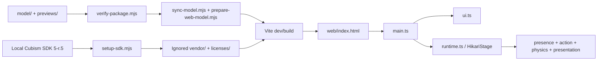

# Architecture

This document describes the checked-in viewer and its boundaries. It is a repository guide, not a claim that every model, browser or device is compatible with the runtime.

## System shape

The canonical model and previews live under `model/` and `previews/`. `scripts/verify-package.mjs` checks the manifest, runtime reference closure and expected inventory. Before a web build, `scripts/sync-model.mjs` runs that check and calls `prepare-web-model.mjs`, which copies the model references into the ignored `web/public/model/hikari_t002/` directory and creates lossless web-only texture files. Canonical PNG, MOC3 and CMO3 files remain in place.

The SDK is an input to local setup, not a repository dependency. `scripts/setup-sdk.mjs` accepts a locally extracted Cubism SDK for Web 5-r.5, checks `cubism-info.yml`, and copies the selected Core, Framework, shader and license files into ignored `web/vendor/`, `web/public/vendor/` and `web/public/licenses/` paths. It does not download or modify the source SDK.

## Ownership by module

| Module | Responsibility |
| --- | --- |
| `web/index.html` | HTML shell, Core script tag, accessible controls and model canvas |
| `web/src/main.ts` | Application lifecycle, stage creation/retry/destroy, the single `hikari:mouth-input` listener and the development-only QA hook |
| `web/src/ui.ts` | DOM state, expressions, outfits, settings, actions, keyboard-visible controls and loading/error states |
| `web/src/runtime.ts` | Cubism model loading, WebGL 2 renderer lifecycle, resource fetching, input gestures, parameter pipeline and frame loop |
| `web/src/action-controller.ts` | Renderer-independent action phases, parameter intents, crossfades, cancellation and pause behavior |
| `web/src/presence.ts` | Deterministic pointer attention, idle cues, posture and small articulated arm outputs |
| `web/src/secondary-motion.ts`, `hair-breeze.ts`, `cloth-breeze.ts` | Bounded secondary motion applied around the native model physics |
| `web/src/expressive-rebound.ts` | Short automatic face response after an allowed greeting or cue |
| `web/src/presentation.ts` | Shared binocular gaze correction and final drawable vertex preparation |
| `web/src/frame-timing.ts` and `async-utils.ts` | Bounded simulation steps and timeout/abort cleanup helpers |
| `scripts/` | SDK setup, model synchronization, manifest checks and reproducible test runners |

`web/src/runtime-capabilities.ts` contains the development capability registry and controls. It is deliberately reachable only through an explicit Vite development build and QA query; it is not a production API.

## Startup and resource flow

1. Vite serves `web/index.html` with the configured base path, `/Amahane_Hikari/` by default. The HTML shell loads the local Core script and the TypeScript entry module.
2. `main.ts` creates the UI callbacks, installs the capture listener for `hikari:mouth-input`, and starts `HikariStage`. On a failure it destroys the current stage and exposes the retry control.
3. `HikariStage.initialize()` starts the Cubism Framework once. Its constructor requires a WebGL 2 context with an 8192 texture-size capability, installs resize, pointer, wheel, keyboard, visibility and context-loss handlers, and keeps the model instance private.
4. `mount()` reads the model3 descriptor, resolves its MOC3, physics, expressions and textures, and fetches the shader files. Texture downloads are bounded to three concurrent requests; each image is decoded and uploaded one at a time. Production WebP textures may use versioned Cache Storage, with a network result as fallback.
5. The model, expressions and physics are mounted into the renderer. `HikariPresentation` records native drawable vertices and prepares the final shared gaze correction. The stage waits for real frames and a clean WebGL error state before marking the canvas ready.
6. `destroy()` aborts pending work, cancels the animation frame, removes DOM listeners, deletes owned textures and motions, releases the renderer context and clears the active mouth input. A retry starts with a fresh stage.

## Frame and parameter pipeline

Every visible browser frame uses the same order. `frame-timing.ts` caps a catch-up interval at 250 ms, divides it into steps of at most `1/30` second, advances simulation through those steps, then presents and draws once.

1. Start from model defaults, or from the frozen final parameter snapshot while paused.
2. If idle motion is enabled, let `PresenceController` write pointer attention, breathing, posture and small arm outputs; apply the blink layer.
3. Let the Cubism expression manager apply the selected expression.
4. Apply an active action's `prePhysicsPose` intents.
5. Evaluate native physics, then apply bounded secondary motion and the arm guard.
6. While the initial Neutral state allows it, apply the short autonomous cue and expressive rebound. Explicit expression choices suppress that automatic face ownership.
7. Apply an active action's `postExpressionFace` intents, preserving eyelid closure and the authored chew transition when relevant.
8. Apply `ParamOutfit` last so outfit selection wins over expression, physics, idle motion and a paused snapshot.
9. Reapply the conservative arm bounds, then apply a non-expired external mouth input. The input is blended back in through the chew exit or cancellation transition.
10. In a development QA session only, apply explicit parameter overrides and record diagnostics. Production builds have no QA handle.
11. Update the frozen snapshot for a future pause and let `HikariPresentation` prepare drawable vertices before the single `drawModel` call.

The order keeps each owner observable and prevents ambient or physics values from accumulating across frames. A parameter ID appearing in the model is not treated as proof of semantic binding: the runtime checks the IDs it needs, while model acceptance still requires Core readback and visual evidence.

## Interaction contracts

### UI and model controls

The UI exposes twelve expression names from the model package, outfit values `0`, `1` and `2`, and the three public action names `curiosity`, `shy` and `smug`. It also controls pointer following, move mode, zoom from `0.85` to `1.6`, pause, reset and greeting. Pointer dragging is enabled only in move mode; keyboard arrows adjust the pan and `Home` recenters it. A reduced-motion preference starts the stage paused and disables follow until the user changes it.

`ActionController` additionally carries `chewLeft` and `chewRight` for the explicit mouth/action boundary. A normal action has `0.52` seconds of entry, `0.54` seconds of hold and `0.70` seconds of exit; crossfades use `0.18` seconds and cancellation uses `0.28` seconds. Its output separates pre-physics pose intents from post-expression face intents, and the runtime checks each action's required IDs against the actual mounted model before starting it.

### Mouth input

`main.ts` registers one capture listener on `window` for `hikari:mouth-input`. A caller should dispatch a `CustomEvent` on `window`; DOM dispatches from the document or a connected element are also observed through the capture path. The detail is either `null` or an object with only these keys:

| Key | Accepted values |
| --- | --- |
| `open` | finite number from `0` to `1` |
| `form` | optional finite number from `-1` to `1` |
| `pucker` | optional finite number from `0` to `1` |
| `ttlMs` | optional finite number from `1` to `1000`; defaults to `180` |

Unknown keys, non-finite values and out-of-range values are rejected without replacing the previous valid input. The TTL uses wall-clock time and expires while the stage is paused. A chew action owns the closed mouth during its active and return phases; external input is handed back as the authored transition completes. The event does not request microphone permission.

### Development QA boundary

`main.ts` exposes `window.__hikariQa` only when Vite's `DEV` flag is true and the URL contains `__charmQa=1` or `__hikariQa=1`. The optional model path must remain same-origin, under the compiled base path, without query/fragment and end in `.model3.json`. The hook can inspect actual parameters, supported actions, motion diagnostics and frame telemetry for acceptance work. It is intentionally absent from production builds and is not a public application API.

## Build and test boundaries

Run commands from `web/`:

| Command | Requires SDK? | What it proves |
| --- | --- | --- |
| `npm run verify` | No | Canonical model/preview manifest, runtime references and expected inventory |
| `npm test` | No | Controller timing, runtime contracts and asynchronous resource cleanup using explicit doubles |
| `npm run test:events` | No; needs a Playwright browser | Real DOM propagation and the README mouth example; no model rendering |
| `npm run setup:sdk -- "/path/to/CubismSdkForWeb-5-r.5"` | Local SDK input | SDK version check and ignored-path setup |
| `npm run build` | Yes | TypeScript check, model synchronization and Vite production build |
| `npm run test:smoke -- URL OUTPUT_DIR` | Yes for the served viewer | Real-browser page entry, resources, expressions, outfits and production UI checks at the supplied URL |

The CI workflow runs the SDK-free checks and installs its pinned Playwright browser; it does not download or redistribute a Cubism SDK. SDK-free passes do not prove native model rendering, GPU compatibility, natural motion, VTube Studio import, camera tracking or support for an untested device.

## Extension rules

For a runtime change, first identify the current owner of the parameter or event and keep the pipeline order explicit. Add a focused SDK-free regression for deterministic logic or event shape, then run a real SDK-backed build and smoke check when rendering, loading or UI behavior is affected. Keep diagnostics behind the development boundary.

For a model change, preserve the canonical source and update the manifest only with the authorized files. Check the model3 reference closure, actual Core parameter ranges, save/reopen/export behavior and visual transitions separately. Do not commit SDK copies, generated web resources or a claim that a finite sample covers every pose.
